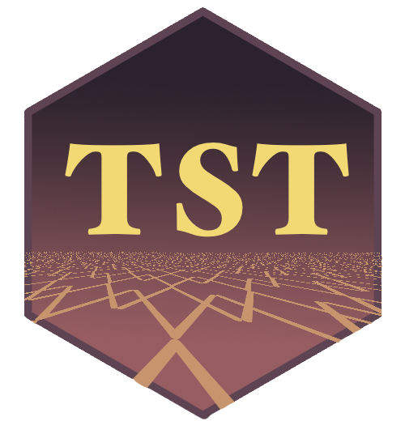

<!-- README.md is generated from README.Rmd. Please edit that file -->
tst 
==================================================================

[](https://cran.r-project.org/package=tst) [](https://www.tidyverse.org/lifecycle/#experimental) [](https://travis-ci.org/uribo/tst) [](https://codecov.io/github/uribo/tst?branch=master) [](https://ci.appveyor.com/project/uribo/tst)

------------------------------------------------------------------------

The goal of **tst** is geo-spatial data testing using the 'testthat' package frameworks. Geo Spatial Data tests including CRS, geometry types, spetial relatons and units correctly.

> NOTES tst: total station theodolite is an electronic/optical instrument used for surveying and building construction.

Installation
------------

You can install the develop version of tst from [GitHub](https://github.com) with:

``` r
# install.packages("remotes")
remotes::install_github("uribo/tst")
```

Example
-------

``` r
library(sf)
#> Linking to GEOS 3.6.1, GDAL 2.1.3, proj.4 4.9.3
library(tst)

x <- st_point(c(0, 0))
expect_geom_type(x, "POINT") # TRUE
```

``` r
expect_geom_type(x, "POLYGON") # FALSE
#  Error: `x`, geometry type is POINT, not POLYGON. 
```

``` r
sfc <- st_sfc(st_point(c(0, 0)),
              st_point(c(1, 1)))
sf <- st_sf(a = 1:2, geom = sfc)
st_crs(sf) <- 4326

expect_crs(sf, 4326)
```

### APIs

-   `expect_geom_type()`
-   `expect_crs()`
-   `expect_dimension()`
-   `expect_units()`
-   ...

### Scope

We will compatible to the objects provided by the following packages. Please write the [issue](https://github.com/uribo/tst/issues/new) if there is a request with other methods. We welcome your contribution :)

-   \[x\] sf (currently working in progress)
-   \[ \] sp
-   \[ \] raster
-   \[ \] stars
-   \[x\] units (currently working in progress)
-   \[ \] geojson
-   \[ \] ...

Code of Conduct
---------------

Please note that this project is released with a [Contributor Code of Conduct](.github/CODE_OF_CONDUCT.md). By participating in this project you agree to abide by its terms.
